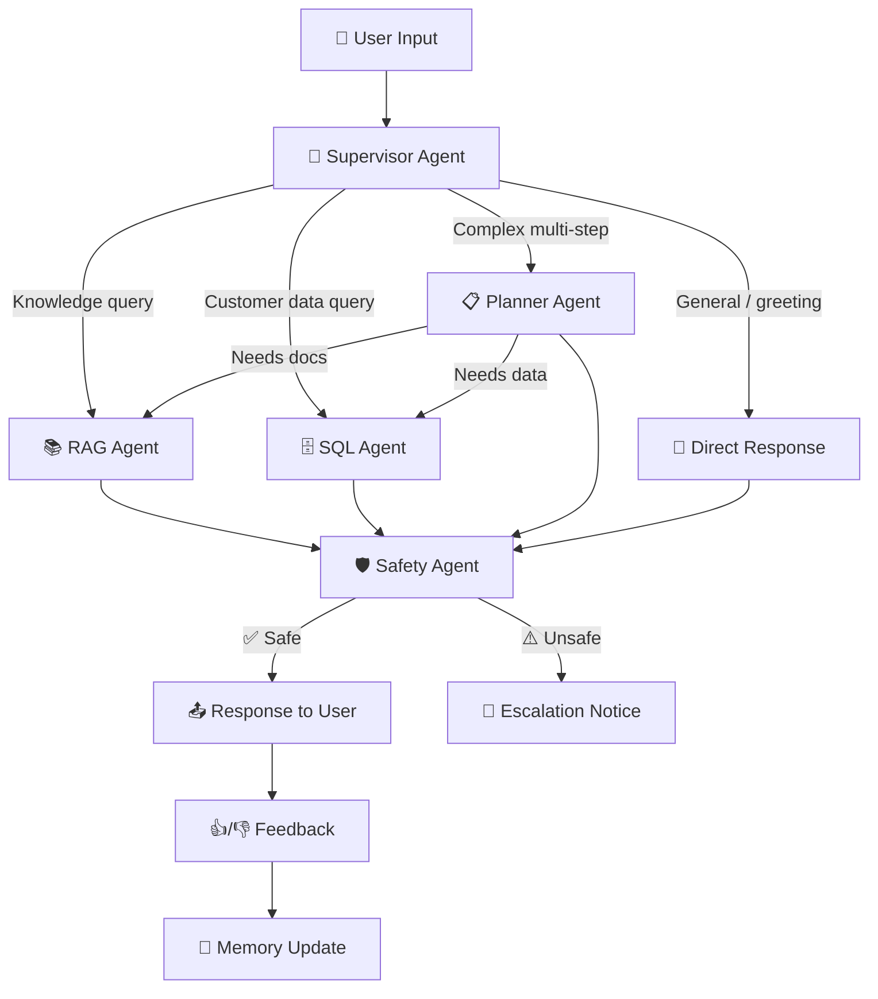

# AI Customer Support Resolution Agent — Combined Implementation Plan

## Goal Description
Build an **industry-grade AI Customer Support Resolution Agent** for **ResolveDesk AI** (a fictional SaaS project management platform) using a **multi-agent system** powered by **LangGraph + LangChain**.

A **Supervisor agent** orchestrates **4 specialist worker agents** (RAG, SQL, Planner, and Safety), each responsible for a distinct domain. All work lives inside `capstone_project/` with a dedicated Python virtual environment.

---

## User Review Required

> [!IMPORTANT]
> **Incremental Execution**: The execution will proceed phase by phase. Each phase extends the same codebase. A wait for your go-ahead is established before starting each new phase.
> 
> **Development Stack**: 
> - **LLM**: Gemini Flash (via `langchain-google-genai`)
> - **Embeddings**: Local HuggingFace Embeddings (e.g. `all-MiniLM-L6-v2`) via `langchain-huggingface` (no OpenAI API used for now)
> - **Vector Database**: Qdrant (local persistent storage via `qdrant-client`)
> - **Primary Execution**: FastAPI Backend + React Frontend (started concurrently via `run.bat`)

---

## Environment Setup & Tech Stack

```
capstone_project\
├── venv\                    # Python virtual environment (already created)
└── ... (project files below)
```

**Activation:** `.\venv\Scripts\activate` (PowerShell on Windows)

### Core Dependencies (Installed Incrementally)

| Phase | Packages |
|---|---|
| Phase 2 | `python-dotenv` |
| Phase 3 | `langchain`, `langchain-google-genai`, `langsmith`, `langgraph` |
| Phase 4 | `qdrant-client`, `langchain-huggingface`, `sentence-transformers` |
| Phase 5 | (no new packages — uses SQLite built-in) |
| Phase 8 | `fastapi`, `uvicorn` (backend); `react`, `lucide-react`, `vite`, `tailwindcss` (frontend) |

### Technology Stack Table

| Component | Technology |
|---|---|
| Frontend | React (TypeScript + Vite + Tailwind CSS v4) |
| Backend | Python 3.10+ (FastAPI + Uvicorn web server) |
| Multi-Agent Framework | **LangGraph** |
| Agent Tooling | LangChain |
| **LLM (default/dev)** | **Gemini Flash (`gemini-1.5-flash`)** |
| Vector DB | **Qdrant (Local Persistent/In-Memory Client)** |
| Embeddings | **HuggingFace (`all-MiniLM-L6-v2`)** |
| Database | SQLite |
| **Logging & Tracing** | **LangSmith** |

---

## Multi-Agent Architecture

### Agent Roster

| Agent | Role | Tools / Capabilities |
|---|---|---|
| **🎯 Supervisor** | Orchestrator — analyzes intent, routes to the right worker, assembles final response | `transfer_to_rag`, `transfer_to_sql`, `transfer_to_planner` (tool-calling) |
| **📚 RAG Agent** | Knowledge specialist — retrieves and synthesizes company docs | Qdrant semantic search, context-grounded answers |
| **🗄️ SQL Agent** | Data specialist — queries live customer records | `customer_lookup`, `subscription_lookup`, `ticket_status`, `payment_history` |
| **📋 Planner Agent** | Task decomposer — breaks complex requests into steps | Multi-step reasoning, coordinates RAG + SQL |
| **🛡️ Safety Agent** | Guardian — validates every response before delivery | PII detection, policy compliance, hallucination flagging, escalation |

### Workflow Diagram



### LangGraph State

```python
from typing import TypedDict, Annotated
from langgraph.graph.message import add_messages

class AgentState(TypedDict):
    messages: Annotated[list, add_messages]   # Conversation history
    current_agent: str                         # Active agent name
    plan_steps: list[str]                      # Planner's decomposed steps
    rag_context: str                           # Retrieved documents
    sql_results: dict                          # Query results
    safety_check: dict                         # Safety validation
    feedback_history: list[dict]               # User feedback log
    session_id: str                            # Memory isolation
```

---

## Project Structure

```
capstone_project\
├── venv\                                        # Virtual environment
├── backend/
│   └── app/
│       ├── agents/                              # Multi-agent system
│       │   ├── __init__.py
│       │   ├── state.py                         # Shared AgentState
│       │   ├── graph.py                         # LangGraph workflow
│       │   ├── supervisor.py                    # 🎯 Supervisor
│       │   ├── rag_agent.py                     # 📚 RAG Agent
│       │   ├── sql_agent.py                     # 🗄️ SQL Agent
│       │   ├── planner_agent.py                 # 📋 Planner Agent
│       │   ├── safety_agent.py                  # 🛡️ Safety Agent
│       │   └── prompts.py                       # All prompt templates
│       ├── tools/
│       │   ├── __init__.py
│       │   ├── rag_tools.py                     # Qdrant search
│       │   ├── sql_tools.py                     # Customer/ticket/payment lookups
│       │   └── safety_tools.py                  # PII detection, policy check
│       ├── memory/
│       │   ├── __init__.py
│       │   └── session_memory.py                # Session-based memory
│       ├── database/
│       │   ├── __init__.py
│       │   └── db_utils.py                      # SQLite helpers
│       ├── evaluation/
│       │   ├── __init__.py
│       │   ├── eval_runner.py                   # Evaluation harness
│       │   └── eval_cases.json                  # Test scenarios
│       ├── feedback/
│       │   ├── __init__.py
│       │   └── feedback_store.py                # Feedback CRUD
│       └── __init__.py
├── config/
│   ├── .env                                     # API keys (gitignored)
│   └── settings.py                              # App configuration
├── knowledge/
│   ├── docs/                                    # 9 RAG source documents
│   │   ├── faq.md
│   │   ├── pricing_guide.md
│   │   ├── refund_policy.md
│   │   ├── subscription_guide.md
│   │   ├── user_manual.md
│   │   ├── troubleshooting_guide.md
│   │   ├── api_documentation.md
│   │   ├── privacy_policy.md
│   │   └── terms_and_conditions.md
│   └── qdrant_db/                               # Qdrant local storage
├── database/
│   ├── schema.sql                               # 5 tables DDL
│   ├── seed_data.sql                            # SQL seed data statements
│   ├── seed_data_generator.py                   # Generates and inserts sqlite seed data
│   └── support.db                               # SQLite file
├── frontend/
│   ├── src/                                     # React source code (App.tsx, index.css, supportApi.ts, etc.)
│   ├── package.json                             # Node package configuration
│   └── vite.config.ts                           # Vite configuration
├── run.bat                                      # Concurrent startup batch script
├── docs/
│   ├── problem_framing.md                       # Phase 1 deliverable
│   ├── prompt_comparison.md                     # Phase 3 deliverable
│   ├── evaluation_report.md                     # Phase 9 deliverable
│   ├── engineering_justification.md             # Architecture decisions
│   └── demo_script.md                           # 3-5 forced interactions
├── requirements.txt
├── .env.example
├── .gitignore
└── README.md
```

---

## Phase-by-Phase Execution Plan

---

### Phase 1: Problem Framing & Success Definition
**Coding:** Not required | **Output:** `docs/problem_framing.md`

- **User Persona**: Customer Success Specialist — handles 50+ tickets/day, needs instant support resolving subscriptions, bills, refunds, and troubleshooting.
- **Success Criteria**: >85% accuracy; <3s latency; 0% fabricated policies; 100% safety escalation; >90% routing accuracy.
- **Edge Cases**: Jailbreak, prompt/SQL injection, cross-user memory leakage, missing RAG documents, database down.

---

### Phase 2: Baseline Rule-Based Agent
**Coding:** Required | **Install:** `python-dotenv`

- Simple single-agent using keyword routing and if-else logic.
- Log inputs and outputs to console.
- **Demonstrate 2+ limitations**: inability to process paraphrased text, no direct customer DB access, lack of conversational memory.

---

### Phase 3: LLM Integration + Multi-Agent Foundation
**Coding:** Required | **Install:** `langchain`, `langchain-google-genai`, `langsmith`, `langgraph`

- Integrate **Gemini Flash (`gemini-1.5-flash`)** using your Google API key.
- Build the **LangGraph StateGraph** featuring the Supervisor agent and worker placeholders.
- Supervisor performs routing using LangChain tool-calling.
- Configure **LangSmith** tracking to debug trace outputs.

---

### Phase 4: RAG Agent (Qdrant & Local Embeddings)
**Coding:** Required | **Install:** `qdrant-client`, `langchain-huggingface`, `sentence-transformers`

- Write the 9 ResolveDesk AI knowledge base documents in `knowledge/docs/`.
- Ingest documents: chunk, convert using **HuggingFace (`all-MiniLM-L6-v2`)**, and store in **local Qdrant** (using a persistent disk path).
- Implement the **RAG Agent** node and verify context retrieval.

---

### Phase 5: SQL Agent (Tool Calling)
**Coding:** Required | **No new packages**

- Build SQLite tables for: `customers`, `subscriptions`, `tickets`, `payments`, `products`.
- Write `seed_data_generator.py` to insert ~100 customers, ~150 subscriptions, ~300 tickets, and ~200 payments.
- Implement read-only SQL lookup tools for the SQL Agent node (`customer_lookup`, `subscription_lookup`, `ticket_status`, `payment_history`).

---

### Phase 6: Planner Agent + Memory
**Coding:** Required

- Build the **Planner Agent** to decompose multi-step tasks (e.g. evaluating cancel + refund requests).
- Implement session checkpointer or custom key-value store to maintain chat history separated by `session_id`.

---

### Phase 7: Safety Agent + Adaptive Behaviour
**Coding:** Required

- Build the **Safety Agent** to validate all final output text:
  - Redacts PII.
  - Rejects database modification attempts.
  - Escalates refund approvals and policy violations.
- Integrate 👍/👎 feedback logging to SQLite; show how the agent can adjust behavior based on feedback logs.

---

### Phase 8: Deployment Readiness (Decoupled API & Frontend)
**Coding:** Required | **Install:** `fastapi`, `uvicorn` (Python backend) | npm packages (React frontend)

- Build a **FastAPI backend** in `backend/app/main.py`:
  - Define `/api/chat`, `/api/feedback`, `/api/history/{session_id}`, and `/api/clear/{session_id}`.
  - Integrate CORS middleware to accept requests from the frontend origin (`http://localhost:5173`).
- Build a **React frontend** in the `frontend/` directory using Vite, TypeScript, and Tailwind CSS v4:
  - Create [App.tsx](file:///c:/Users/User/Desktop/python/capstone_project/frontend/src/App.tsx) with a multi-pane interface: Chat pane (bubbles, 👍/👎 logs) and Agent Trace Panel (active specialist node, safety compliance audits, planner tasks, and live SQLite traces).
- Create a [run.bat](file:///c:/Users/User/Desktop/python/capstone_project/run.bat) batch script to concurrently start the backend and frontend dev servers.

---

### Phase 9: Evaluation & Engineering Review
**Coding:** Required

- Prepare standard JSON evaluation scenarios in `backend/app/evaluation/eval_cases.json`.
- Execute accuracy, groundedness, latency, routing, and safety compliance checks.
- Produce `docs/evaluation_report.md` and `docs/engineering_justification.md`.

---

## Verification Plan

### Execution Command List
```bash
# Activate Virtual Environment
.\venv\Scripts\activate

# Install Dependencies
pip install -r requirements.txt

# Ingest RAG Knowledge Documents
python backend/app/knowledge/ingest.py

# Seed SQLite database
python database/seed_data_generator.py

# Run concurrently (Backend + Frontend)
.\run.bat
```
