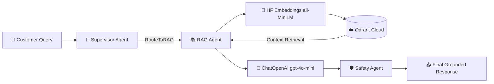

# Phase 4: RAG Agent & Document Ingestion Report

This report documents the design, technical implementation, and verification results for **Phase 4** of the ResolveDesk AI Multi-Agent System. This phase focuses on building the document ingestion pipeline and integrating the RAG Specialist Agent.

---

## 1. Document Ingestion Pipeline

To populate the ResolveDesk AI knowledge base, we wrote 9 comprehensive PDF files outlining company policies, faqs, guides, and manuals. We then built a python ingestion script (`backend/app/knowledge/ingest.py`) to process them.

### Ingestion Pipeline Architecture
1. **PDF Parsing**: Used `pypdf` (`PdfReader`) to load and extract text from the 9 source PDFs in [knowledge/docs/](file:///c:/Users/User/Desktop/python/capstone_project/knowledge/docs).
2. **Text Chunking**: Chunked extracted text using LangChain's `RecursiveCharacterTextSplitter` with a `chunk_size` of 500 characters and a `chunk_overlap` of 50 characters.
3. **Local Embedding Generation**: Utilized **HuggingFace Embeddings** (`all-MiniLM-L6-v2` via `sentence-transformers`) to generate local vector embeddings (384 dimensions) for each text chunk.
4. **Vector Store Upsert**: Configured `QdrantClient` in server/cloud mode to connect to the Qdrant Cloud cluster, create/recreate the collection `resolvedesk_docs`, and upload the generated vectors with source path metadata.

### Knowledge Base Catalog
The following 9 documents were loaded and processed into Qdrant:
* [api_documentation.pdf](file:///c:/Users/User/Desktop/python/capstone_project/knowledge/docs/api_documentation.pdf)
* [faq.pdf](file:///c:/Users/User/Desktop/python/capstone_project/knowledge/docs/faq.pdf)
* [pricing_guide.pdf](file:///c:/Users/User/Desktop/python/capstone_project/knowledge/docs/pricing_guide.pdf)
* [privacy_policy.pdf](file:///c:/Users/User/Desktop/python/capstone_project/knowledge/docs/privacy_policy.pdf)
* [refund_policy.pdf](file:///c:/Users/User/Desktop/python/capstone_project/knowledge/docs/refund_policy.pdf)
* [subscription_guide.pdf](file:///c:/Users/User/Desktop/python/capstone_project/knowledge/docs/subscription_guide.pdf)
* [terms_and_conditions.pdf](file:///c:/Users/User/Desktop/python/capstone_project/knowledge/docs/terms_and_conditions.pdf)
* [troubleshooting_guide.pdf](file:///c:/Users/User/Desktop/python/capstone_project/knowledge/docs/troubleshooting_guide.pdf)
* [user_manual.pdf](file:///c:/Users/User/Desktop/python/capstone_project/knowledge/docs/user_manual.pdf)

---

## 2. RAG Agent Implementation

The RAG Agent Specialist was integrated into the LangGraph state graph to answer informational queries.

* **Tool Component ([rag_tools.py](file:///c:/Users/User/Desktop/python/capstone_project/backend/app/tools/rag_tools.py))**: Defines `query_knowledge_base()`, which embeds incoming customer queries and searches the Qdrant server for the top 3 semantically closest chunks.
* **Agent Node ([rag_agent.py](file:///c:/Users/User/Desktop/python/capstone_project/backend/app/agents/rag_agent.py))**: Executes the tool, binds the retrieved context to the system prompt, and calls `ChatOpenAI` to generate a grounded response.
* **Safety Protocol**: Instructs the RAG Agent to only respond using the context provided. If information is missing, the agent outputs: *"I'm sorry, but I couldn't find information in the documentation to answer your request."*

---

## 3. Execution & Verification Logs

We ran the ingestion pipeline and verified the RAG Specialist Agent's retrieval accuracy.

### Ingestion Output Log
```text
Loaded 9 documents. Splitting into chunks...
Created 22 chunks from documents.
Connecting to Qdrant server/cloud at https://xxxx.aws.cloud.qdrant.io...
Recreating Qdrant collection: 'resolvedesk_docs'...
Initializing HuggingFaceEmbeddings (all-MiniLM-L6-v2)...
Embedding chunks and preparing points for upload...
Upserting 22 points into Qdrant collection...
Ingestion pipeline completed successfully!
```

### Retrieval & Generation Log
* **User Query**: `"how can i reset my password"`
* **Retrieved context chunks (from `faq.pdf`)**:
  ```text
  How do I change my password?
  You can change your password by navigating to User Settings > Security > Change Password. Fill in your current password and define a new one. Remember that passwords must be at least 10 characters long and contain both letters and numbers.
  ```
* **Grounded LLM Response**:
  ```text
  You can reset your password by navigating to User Settings > Security > Change Password. Fill in your current password and define a new one. Remember that your new password must be at least 10 characters long and contain both letters and numbers.
  ```

---

## 4. Architectural Summary


