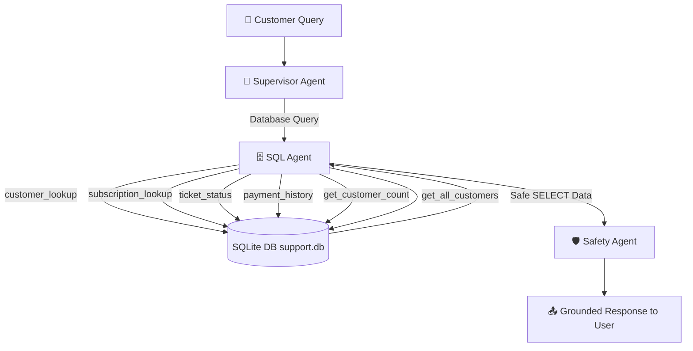

# Phase 5: SQL Specialist Agent & Database Seeding Report

This report documents the design, technical implementation, and verification results for **Phase 5** of the ResolveDesk AI Multi-Agent System. This phase focuses on initializing a local SQLite support database, seeding it with realistic customer records spanning January 2026 to December 2027, creating read-only query tools with SELECT-only safety guardrails, and integrating the SQL Specialist Agent.

---

## 1. Database Architecture & Schema Design

A local relational database `database/support.db` defined by the SQL DDL schema in [schema.sql](file:///c:/Users/User/Desktop/python/capstone_project/database/schema.sql) was established:

1. **`customers`**: Represents registered customer accounts.
   * `customer_id` (TEXT PRIMARY KEY)
   * `name` (TEXT)
   * `email` (TEXT UNIQUE)
   * `phone` (TEXT)
   * `created_at` (TEXT)
2. **`products`**: Pricing plans and tiers.
   * `product_id` (TEXT PRIMARY KEY)
   * `name` (TEXT)
   * `price` (REAL)
   * `billing_cycle` (TEXT) - `'monthly'` or `'annual'`
3. **`subscriptions`**: Active, expired, or cancelled customer plans.
   * `subscription_id` (TEXT PRIMARY KEY)
   * `customer_id` (TEXT, FK referencing `customers`)
   * `product_id` (TEXT, FK referencing `products`)
   * `status` (TEXT) - `'active'`, `'cancelled'`, `'expired'`
   * `start_date` (TEXT), `end_date` (TEXT)
   * `cancel_at_period_end` (INTEGER) - `0` (False) or `1` (True)
4. **`payments`**: Transaction and invoice records.
   * `payment_id` (TEXT PRIMARY KEY)
   * `customer_id` (TEXT, FK referencing `customers`)
   * `amount` (REAL)
   * `status` (TEXT) - `'success'`, `'failed'`, `'refunded'`
   * `payment_method` (TEXT)
   * `created_at` (TEXT)
5. **`tickets`**: Customer support issues.
   * `ticket_id` (TEXT PRIMARY KEY)
   * `customer_id` (TEXT, FK referencing `customers`)
   * `title` (TEXT), `description` (TEXT)
   * `status` (TEXT) - `'open'`, `'in_progress'`, `'resolved'`, `'closed'`
   * `priority` (TEXT) - `'low'`, `'medium'`, `'high'`
   * `created_at` (TEXT)

---

## 2. Deterministic Seeding

The script [seed_data_generator.py](file:///c:/Users/User/Desktop/python/capstone_project/database/seed_data_generator.py) was implemented to populate the database deterministically:
* Uses a fixed random seed (`random.seed(42)`) to ensure reproducible mock data.
* Automatically wipes existing database tables using `DROP TABLE IF EXISTS` to prevent stale records from polluting subsequent seeding runs.
* Generates exactly **100 customers**, **150 subscriptions**, **228 payments**, and **300 tickets**.
* Bounds all record datetimes between **January 2026 and December 2027** to represent active platform operations.
* Injects explicit duplicate customer names (two **John Smith**s and two **Emma Davis**s) to verify duplicate name resolution guardrails.

---

## 3. Read-Only SQL Lookup Tools

Safe, read-only SQL lookup tools were implemented in [sql_tools.py](file:///c:/Users/User/Desktop/python/capstone_project/backend/app/tools/sql_tools.py):
* **`customer_lookup(query)`**: Search customer profiles by ID, email, or name (supporting wildcard matches).
* **`subscription_lookup(customer_id)`**: Fetch all subscription details and associated plan prices for a customer.
* **`ticket_status(query)`**: Fetch status and description details for support tickets by ticket_id or customer_id.
* **`payment_history(customer_id)`**: Retrieve recent payment records and statuses.
* **`get_customer_count()`**: Retrieve the total count of customers registered in the database.
* **`get_all_customers()`**: Retrieve IDs, names, emails, and phone numbers for all registered customers.
* **SELECT-only query guardrail**: Enforces that any query passed to `run_select_query()` must start with the `SELECT` command, raising a `ValueError` for modifying statements (`DELETE`, `UPDATE`, `DROP`, etc.).

---

## 4. Multi-Agent Graph Integration

The SQL specialist was wired into the LangGraph network:
* **[sql_agent.py](file:///c:/Users/User/Desktop/python/capstone_project/backend/app/agents/sql_agent.py)**: Defines `sql_node`, which binds database lookup tools to the LLM, executes them in a 3-turn loop, and records search logs into `sql_results` for UI rendering.
* **Supervisor Update ([supervisor.py](file:///c:/Users/User/Desktop/python/capstone_project/backend/app/agents/supervisor.py))**: Extended instructions to route customer counting, database metrics, and customer listings to the SQL Agent.
* **Message History Filtering**: Configured the SQL Agent to strip unanswered supervisor routing tool calls (`RouteToSQL`) from the thread history, preventing OpenAI API bad request validation errors.

---

## 5. Verification Logs

The system was validated using the automated test script, producing the following output:

```text
======================================
QUERY: 'How many customers are registered in the ResolveDesk database?'
Routed specialist agent: SQL Agent
SQL trace logs: {'get_customer_count': {'args': {}, 'data': 'Total customer count: 100'}}
Response:
There are 100 customers registered in the ResolveDesk database.

======================================
QUERY: 'Can you look up the customer John Smith?'
Routed specialist agent: SQL Agent
SQL trace logs: {'customer_lookup': {'args': {'query': 'John Smith'}, 'data': "[{'customer_id': 'cust_010', 'name': 'John Smith', 'email': 'john.smith.10@example.com', 'phone': '555-718-5333', 'created_at': '2026-01-12 00:00:00'}, {'customer_id': 'cust_020', 'name': 'John Smith', 'email': 'john.smith.20@example.com', 'phone': '555-941-1525', 'created_at': '2026-03-22 00:00:00'}]"}}
Response:
I found two customers named John Smith:

1. **Customer ID:** cust_010
   - **Email:** john.smith.10@example.com
   - **Phone:** 555-718-5333

2. **Customer ID:** cust_020
   - **Email:** john.smith.20@example.com
   - **Phone:** 555-941-1525

Please specify which customer you would like more information about by providing the customer ID.

======================================
QUERY: 'Show me Emma Davis subscription details.'
Routed specialist agent: SQL Agent
SQL trace logs: {'customer_lookup': {'args': {'query': 'Emma Davis'}, 'data': "[{'customer_id': 'cust_030', 'name': 'Emma Davis', 'email': 'emma.davis.30@example.com', 'phone': '555-357-1188', 'created_at': '2026-01-30 00:00:00'}, {'customer_id': 'cust_040', 'name': 'Emma Davis', 'email': 'emma.davis.40@example.com', 'phone': '555-849-8962', 'created_at': '2026-01-18 00:00:00'}]"}}
Response:
I found two customer records for Emma Davis:

1. **Customer ID:** cust_030
   - **Email:** emma.davis.30@example.com
   - **Phone:** 555-357-1188

2. **Customer ID:** cust_040
   - **Email:** emma.davis.40@example.com
   - **Phone:** 555-849-8962

Please specify which customer ID you would like to see the subscription details for.
```

---

## 6. Architectural Summary


