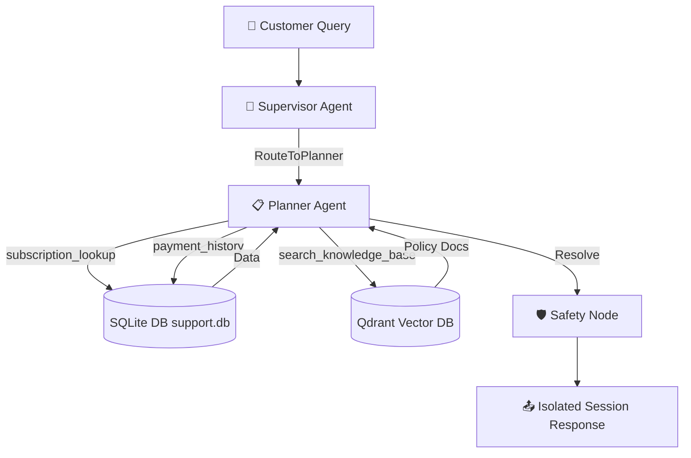

# Phase 6: Planner Agent & Session Memory Isolation Report

This report documents the design, technical implementation, and verification results for **Phase 6** of the ResolveDesk AI Multi-Agent System. This phase focuses on establishing conversation history isolation per user session and implementing the Planner Specialist Agent to resolve complex, multi-step customer inquiries.

---

## 1. Conversational Memory Isolation

To prevent message history from leaking across user sessions, we integrated LangGraph's checkpointer mechanism:

* **[session_memory.py](file:///c:/Users/User/Desktop/python/capstone_project/backend/app/memory/session_memory.py)**: Instantiates a shared `MemorySaver` checkpointer.
* **[graph.py](file:///c:/Users/User/Desktop/python/capstone_project/backend/app/agents/graph.py)**: Compiles the StateGraph with the checkpointer:
  ```python
  from backend.app.memory.session_memory import memory_checkpointer
  graph = builder.compile(checkpointer=memory_checkpointer)
  ```
* **[main.py](file:///c:/Users/User/Desktop/python/capstone_project/backend/app/main.py)**: Refactored the `/api/chat` API endpoint to only send the **new user message** in the `messages` state input. LangGraph's checkpointer automatically loads and appends to the conversation history associated with the corresponding `session_id` (passed as the `thread_id` config parameter).

---

## 2. The Planner Specialist Agent

We implemented the Planner Specialist Agent to decompose and resolve complex, multi-step customer queries (e.g. evaluating cancel + refund requests):

* **[planner_agent.py](file:///c:/Users/User/Desktop/python/capstone_project/backend/app/agents/planner_agent.py)**:
  * Defines `planner_node` with access to the SQL database tools (`customer_lookup`, `subscription_lookup`, `ticket_status`, `payment_history`) and the company document vector store (wrapped in `search_knowledge_base`).
  * Employs an LLM tool-calling loop (up to 4 turns) to sequentially fetch customer data and retrieve refund policies before making logical compliance decisions.
  * Dynamically populates the `plan_steps` list in the graph state to outline execution tasks in the frontend trace panel.

---

## 3. Database Date Consistency Refactor

We resolved an inconsistency in the seeded database where expired subscription durations were marked as active:

* **[seed_data_generator.py](file:///c:/Users/User/Desktop/python/capstone_project/database/seed_data_generator.py)**:
  * Uses the execution date (`datetime.now()`) as the reference "today" date.
  * Active subscriptions are generated with start dates in the past and end dates strictly in the future (e.g., `start_dt + 30 days`).
  * Expired or cancelled subscriptions are generated entirely in the past relative to the execution date.
  * Dynamically generates a consistent billing cycle renewal history (1 to 4 previous expired subscriptions and matching successful payments) for active monthly subscribers.
  * Binds customer signup and ticket creation dates to be logically in the past relative to the oldest subscription start.

---

## 4. Message History Filtering

To avoid OpenAI API 400 validation errors caused by unmatched supervisor routing tool calls (`RouteToSQL`, `RouteToPlanner`, `RouteToRAG`) or specialist tool call traces in the conversation history, we implemented a robust filtering check across all agents:

* Prior to calling `chain.invoke()` or `llm.invoke()`, the message thread is filtered to **only include HumanMessages and AIMessages that do not contain tool_calls**.
* This strips raw execution traces and unmatched routing requests, keeping the context clean and compliant with OpenAI completion guidelines.

---

## 5. Verification & Test Logs

We verified the implementation using the automated test harness [test_planner_agent.py](file:///C:/Users/User/.gemini/antigravity-ide/brain/b5f4417d-6551-437c-bd96-cfd3c8f2a05a/scratch/test_planner_agent.py):

### 5.1. Complex Cancellation and Refund Evaluation
* **Query**: `"I want to cancel my account and get a refund. My customer ID is cust_083."`
* **Execution Outcome**:
  * **Routed Specialist**: `Planner Agent`
  * **Dynamic Plan Steps**:
    1. `1. SQL: Lookup customer subscription info`
    2. `2. RAG: Query company refund policy rules`
    3. `3. Assess eligibility & output resolution`
  * **Database Lookup Traces**:
    * Active Subscription: `Basic Plan`, valid `2026-07-07` to `2026-08-06` (active today).
    * Expired Subscriptions: Three prior cycles starting from April 8, May 8, and June 7.
    * Payments: Four successful payments matching subscription cycles.
  * **Final Response**:
    > *"According to the company's refund policy, monthly subscriptions are strictly non-refundable. Since you are on a monthly subscription, you will not be eligible for a refund upon cancellation. You can cancel your subscription, and it will remain active until the end of the current billing cycle on August 6, 2026."*

### 5.2. Conversational Memory Isolation
* **Turn 1 (Session Alice)**: `"Hello! I am a support engineer named Alice Smith."`
* **Turn 2 (Session Bob)**: `"What is my name?"`
  * **Response**: *"I'm unable to access personal information, including your name. How can I assist you today?"* (Bob's session remains empty; no memory leakage).
* **Turn 3 (Session Alice)**: `"What is my name?"`
  * **Response**: *"Your name is Alice Smith. How can I assist you further?"* (Alice's session correctly recalls history via the MemorySaver checkpointer).

---

## 6. Architecture & Workflow


